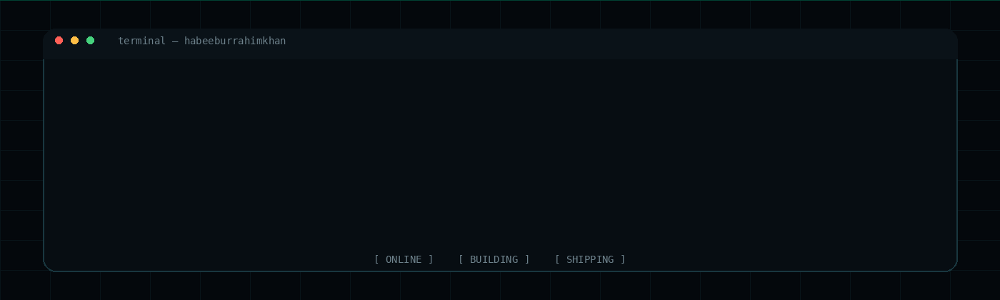
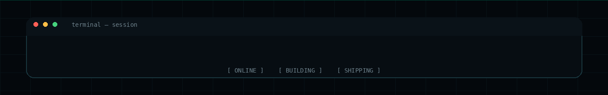

<!-- HABEEB UR RAHIM KHAN | GitHub Profile -->

<p align="center">
  
</p>

<p align="center">
  <a href="https://github.com/habeeburrahimkhan">
    
  </a>
  <a href="https://www.instagram.com/habeeburrahimkhan/">
    
  </a>
  <a href="mailto:habeebrahimkhan@gmail.com">
    
  </a>
</p>

<p align="center">
  <code>ARTIFICIAL INTELLIGENCE</code> &nbsp; <code>MACHINE LEARNING</code> &nbsp; <code>FULL-STACK</code> &nbsp; <code>CLOUD</code>
</p>

---

## `> about`

<p align="center">
  
</p>

I build software at the intersection of **AI/ML and modern software engineering**.

My work spans intelligent applications, full-stack systems, APIs, databases, real-time communication, machine-learning pipelines, cloud infrastructure, and secure software.

I care about taking an idea beyond a prototype — **design it, build it, test it, deploy it, and keep improving it.**

```text
BUILD  →  BREAK  →  LEARN  →  REBUILD  →  SHIP
```

---

## `> stack`

### Languages
<p align="center">
  
</p>

<p align="center">
  <code>Python</code> <code>Java</code> <code>JavaScript</code> <code>TypeScript</code> <code>Dart</code> <code>Go</code>
</p>

### Frontend
<p align="center">
  
</p>

<p align="center">
  <code>HTML</code> <code>CSS</code> <code>React</code> <code>Next.js</code> <code>Tailwind CSS</code> <code>Redux</code> <code>React Query</code>
</p>

### Backend & APIs
<p align="center">
  
</p>

<p align="center">
  <code>Node.js</code> <code>Express</code> <code>Flask</code> <code>GraphQL</code> <code>WebSocket</code> <code>WebRTC</code> <code>Mediasoup</code> <code>Strapi</code>
</p>

### AI / ML
<p align="center">
  
</p>

<p align="center">
  <code>TensorFlow</code> <code>PyTorch</code> <code>scikit-learn</code> <code>OpenCV</code> <code>NLP</code> <code>PennyLane</code> <code>Groq API</code> <code>Llama 3.1</code> <code>Gemini API</code>
</p>

### Databases
<p align="center">
  
</p>

<p align="center">
  <code>MongoDB</code> <code>MySQL</code> <code>PostgreSQL</code> <code>Supabase</code> <code>Firebase</code>
</p>

### Cloud / DevOps
<p align="center">
  
</p>

<p align="center">
  <code>AWS</code> <code>EC2</code> <code>RDS</code> <code>S3</code> <code>Lambda</code> <code>Google Cloud</code> <code>Docker</code> <code>Kubernetes</code> <code>Prometheus</code> <code>Grafana</code> <code>Vercel</code> <code>Netlify</code>
</p>

### Tools & Platforms
<p align="center">
  
</p>

<p align="center">
  <code>Git</code> <code>GitHub</code> <code>VS Code</code>
</p>

---

---

## `> github`

<p align="center">
  
</p>

<p align="center">
  
</p>

---

## `> contribution_matrix`

<p align="center">
  
</p>

---

## `> connect`

<p align="center">
  <a href="https://github.com/habeeburrahimkhan">
    
  </a>
  <a href="https://www.instagram.com/habeeburrahimkhan/">
    
  </a>
  <a href="mailto:habeebrahimkhan@gmail.com">
    
  </a>
</p>

<p align="center">
  <i>Open to interesting ideas, technical collaborations, and building things that matter.</i>
</p>

---

<p align="center">
  
</p>
