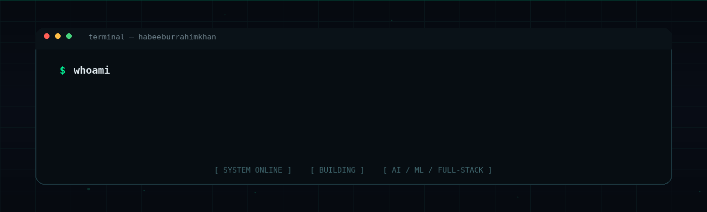

<p align="center">
  
</p>

<p align="center">
  <strong>AI/ML Engineer · Full-Stack Developer · Builder</strong>
</p>

<p align="center">
  <a href="https://github.com/habeeburrahimkhan">
    
  </a>
  <a href="https://www.instagram.com/habeeburrahimkhan/">
    
  </a>
  <a href="mailto:habeebrahimkhan@gmail.com">
    
  </a>
</p>

<p align="center">
  <code>AI</code> <code>ML</code> <code>FULL-STACK</code> <code>CLOUD</code> <code>SYSTEMS</code>
</p>

---

## `> whoami`

```text
┌──────────────────────────────────────────────────────────────┐
│ $ whoami                                                     │
│                                                              │
│ HABEEB UR RAHIM KHAN                                         │
│ AI/ML ENGINEER  •  FULL-STACK DEVELOPER  •  BUILDER          │
│                                                              │
│ Building intelligent systems and scalable software.          │
│ Turning ideas → architecture → code → deployment.             │
│                                                              │
│ STATUS: BUILDING                                             │
└──────────────────────────────────────────────────────────────┘
```

I build software at the intersection of **Artificial Intelligence, Machine Learning, Full-Stack Engineering, Cloud, and Systems**.

My interests span intelligent applications, modern web architecture, APIs, databases, machine-learning pipelines, real-time systems, secure software, and cloud infrastructure.

`BUILD → BREAK → LEARN → REBUILD → SHIP`

---

## `> tech_stack`

### `LANGUAGES`

<p align="center">
  
</p>

<p align="center">
  <code>Python</code> <code>Java</code> <code>JavaScript</code> <code>TypeScript</code> <code>Dart</code> <code>Go</code>
</p>

### `FRONTEND`

<p align="center">
  
</p>

<p align="center">
  <code>HTML</code> <code>CSS</code> <code>React</code> <code>Next.js</code> <code>Tailwind CSS</code> <code>Redux</code> <code>React Query</code>
</p>

### `BACKEND`

<p align="center">
  
</p>

<p align="center">
  <code>Node.js</code> <code>Express</code> <code>Flask</code> <code>WebSocket</code> <code>WebRTC</code> <code>Mediasoup</code> <code>GraphQL</code> <code>Strapi</code>
</p>

### `AI / MACHINE LEARNING`

<p align="center">
  
</p>

<p align="center">
  <code>TensorFlow</code> <code>PyTorch</code> <code>scikit-learn</code> <code>OpenCV</code> <code>NLP</code> <code>PennyLane</code> <code>Groq API</code> <code>Llama 3.1</code> <code>Gemini API</code>
</p>

### `DATABASES`

<p align="center">
  
</p>

<p align="center">
  <code>MongoDB</code> <code>MySQL</code> <code>PostgreSQL</code> <code>Supabase</code> <code>Firebase</code>
</p>

### `CLOUD / DEVOPS`

<p align="center">
  
</p>

<p align="center">
  <code>AWS</code> <code>EC2</code> <code>RDS</code> <code>S3</code> <code>Lambda</code> <code>Google Cloud</code> <code>Docker</code> <code>Kubernetes</code> <code>Prometheus</code> <code>Grafana</code> <code>Vercel</code> <code>Netlify</code>
</p>

### `TOOLS / PLATFORMS`

<p align="center">
  
</p>

<p align="center">
  <code>Git</code> <code>GitHub</code> <code>VS Code</code> <code>Firebase</code> <code>Supabase</code>
</p>

---

## `> engineering_domains`

```text
[01] ARTIFICIAL INTELLIGENCE
[02] MACHINE LEARNING
[03] FULL-STACK ENGINEERING
[04] CLOUD & DEVOPS
[05] REAL-TIME SYSTEMS
[06] SECURE SOFTWARE
[07] SCALABLE BACKEND SYSTEMS
```

---

## `> github`

<p align="center">
  
</p>

<p align="center">
  
</p>

---

## `> contribution_matrix`

<p align="center">
  
</p>

---

## `> portfolio`

<p align="center">
  <code>PORTFOLIO: COMING SOON</code>
</p>

<p align="center">
  <i>Projects, case studies, experiments, and technical deep-dives will live here.</i>
</p>

<!-- Add your portfolio URL here when it is ready. -->

---

## `> connect`

<p align="center">
  <a href="https://github.com/habeeburrahimkhan">
    
  </a>
  <a href="https://www.instagram.com/habeeburrahimkhan/">
    
  </a>
  <a href="mailto:habeebrahimkhan@gmail.com">
    
  </a>
</p>

<p align="center">
  <code>OPEN TO IDEAS · COLLABORATION · BUILDING</code>
</p>

---

<p align="center">
  <code>01001000 01000001 01000010 01000101 01000101 01000010</code>
</p>

<p align="center">
  <strong>BUILD → BREAK → LEARN → REBUILD → SHIP</strong>
</p>
